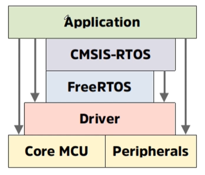

# Curso FreeRTOS Essencial com STM32

Este repositório contém minhas anotações, exercícios e códigos de exemplo do treinamento **FreeRTOS Essencial com STM32**, ministrado pelo instrutor **Pablo Jean Rozario**. O curso está disponível na Udemy no seguinte [link](https://www.udemy.com/course/freertos-essencial/?couponCode=ST6MT60525G3).

Aqui, você encontrará recursos úteis para entender melhor o funcionamento do FreeRTOS em conjunto com microcontroladores STM32, incluindo a documentação oficial, exemplos práticos e referências externas.

---

## Índice

1. [Documentação e Ferramentas](#documentação-e-ferramentas)
2. [Módulos do Curso](#módulos)
3. [Exercícios e Códigos de Exemplo](#exercícios-e-códigos-de-exemplo)

---

## Documentação e Ferramentas

Aqui estão algumas das principais ferramentas e documentos necessários para o desenvolvimento com STM32 e FreeRTOS:

- **HAL (Hardware Abstraction Layer) disponibilizado pela ST**: [Documentação HAL](https://www.st.com/content/st_com/en/search.html#q=hardware%20abstraction%20layer%20-t=resources-page=1)
- **NUCLEO-G474RE**: [Product overview](https://www.st.com/en/evaluation-tools/nucleo-g474re.html)
- **Site Oficial do FreeRTOS**: https://www.freertos.org/

### Ferramentas de Desenvolvimento

- **[STM32Cube GitHub](https://github.com/STMicroelectronics)**: Repositório oficial com diversas ferramentas e bibliotecas.
- **[STM32CubeIDE - Portal de Recursos](https://wiki.st.com/stm32mcu/index.php?title=STM32CubeIDE:Introduction_to_STM32CubeIDE&sfr=stm32mcu)**: Portal de recursos para o STM32CubeIDE.

---

## Módulos

Este curso é dividido em 10 módulos principais, que cobrem desde a introdução ao FreeRTOS até conceitos mais avançados de sincronização e comunicação entre tarefas.

### 1. [Introdução ao Curso FreeRTOS Essencial](#1-introdução-ao-curso-freertos-essencial)

### 2. [Introdução ao FreeRTOS](#2-introdução-ao-freertos)
 - **Principais Características:**
    - Core em tempo real
    - Kernel leve
    - Gerenciamento (sincronização e comunicação) de Tasks
    - Times
    - Gerenciamento de Memoria
    - Multiplataforma

### 3. [Documentação e Padronização do FreeRTOS](#3-documentação-e-padronização-do-freertos)

- [FreeRTOS Documentation](https://www.freertos.org/Documentation/00-Overview)

- [Books and manual](https://www.freertos.org/Documentation/02-Kernel/07-Books-and-manual/01-RTOS_book)

- [Supported Devices](https://www.freertos.org/Documentation/02-Kernel/03-Supported-devices/00-Supported-devices)

- **Convenções**
 
    - Para variáveis:

        

        

    - Para funções:

        

    - Para macros: Sempre escrita em *upper case*, exceto o seu prefixo.

        

- **Estrutura dos diretórios**
    ```bash
    ├── Root
    │   ├── examples
    │   ├── include
    │   └── portable
    |       ├── MenMang
    |       └── {Compiler}/{Core}
    ```

### 4. [Instalando o FreeRTOS no Microcontrolador](#4-instalando-o-freertos-no-microcontrolador)

- **Método 1 (Easy):** através no STMCubeIDE (CMSIS-RTOS)

    

    - Habilitar:

        
    
        **Importante:** Em ``SYS Mode Configuration``, utilize um ``Timebase Source`` diferente do ``SysTick``, pois esse será exclusivo do FreeRTOS. E em ``Advanced settings``, deixe o ``USE_NEWLIB_REENTRANT`` habilitado.

- **Método 2 (Hard):** importando do projeto no Github e instalando manualmente. 

1. Criar o projeto e configurar o ``SysTick``.
2. Download do FreeRTOS.
3. Remover os arquivos desnecessários do ``/portable``.
4. Copiar a template ``FreeRTOSConfig.h``.
5. Importar os arquivos do diretório ``/portable`` e indicar os caminhos de compilação.
6. Configurar as interrupções (``SysTick``, ``SVC``, ``PendSV``) e o ``FreeRTOSConfig.h``.

### 5. [Entendendo as Tarefas (Tasks)](#5-entendendo-as-tarefas-tasks)

### 6. [Entendendo as Filas (Queues)](#6-entendendo-as-filas-queues)

### 7. [Entendendo os Semáforos (Semaphores)](#7-entendendo-os-semaforos-semaphores)

### 8. [Entendendo as Gatekeeper Tasks](#8-entendendo-as-gatekeeper-tasks)

### 9. [Entendendo as Notificações de Tarefas (TaskNotify)](#9-entendendo-as-notificações-de-tarefas-tasknotify)

### 10. [Entendendo os Eventos (Event Groups)](#10-entendendo-os-eventos-event-groups)

---

## Exercícios e Códigos de Exemplo

Neste repositório, você também encontrará códigos de exemplo e atividades práticas para consolidar o aprendizado. Para visualizar os códigos e exercícios realizados durante o curso, acesse a pasta correspondentes nos seguinte diretório:

- `projetos/`: Exemplos práticos e atividades do curso.

